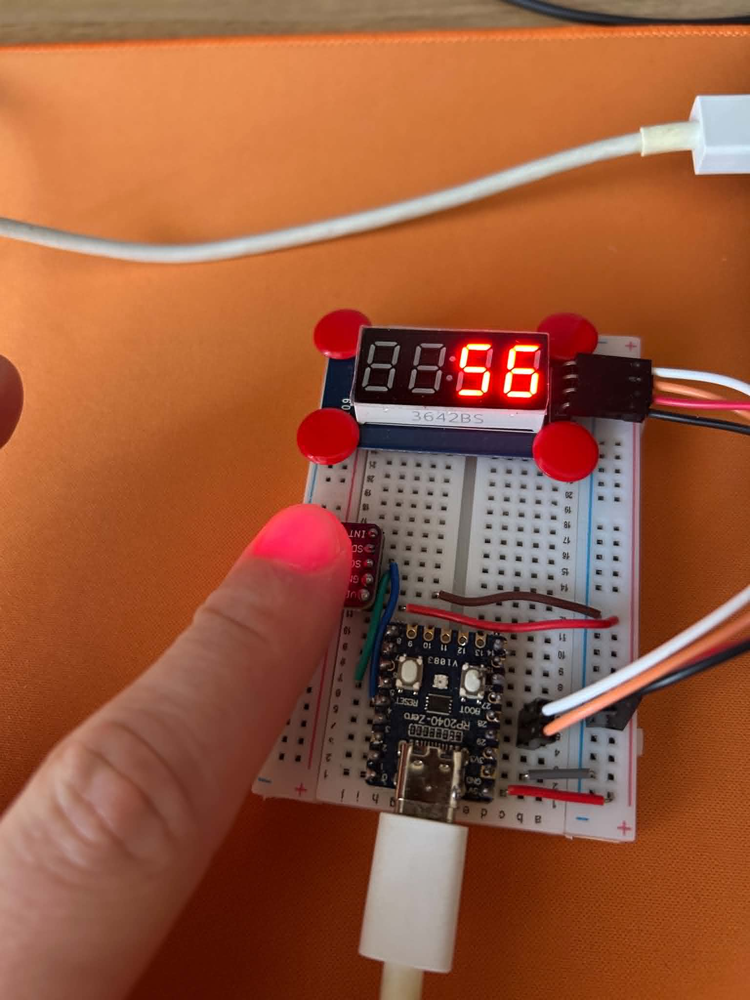

# Heartbeat Detector

Hardware Scheme and firmware for MCU based BPM (beats per minute) calculator.

## Hardware Requirements

- RP2040 Zero MCU (core computing unit)
- GY-MAX30102 (heartbeat optical sensor)
- TM1637 4-cell 7-segment display (to display BPM values)
- Wires, Power Supply

## Software Requirements

- Arduino Core libraries (mainly `Wire.h` for I2C)
- `TM1637Display.h` (display driver)
- `MAX30105.h` (sensor driver)
- `heartRate.h` (hearbeat detection)

## Physical Prototype

## Single Detected Heartbeat

